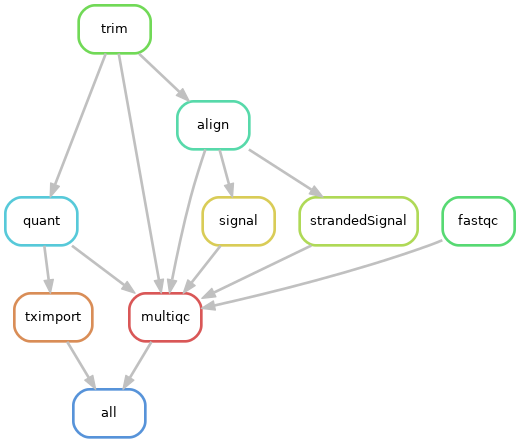

# bagPipes
***********************

### Overview
***********************
bagPipes is a collection of next-gen sequencing processing pipelines for the Phanstiel Lab.

bagPipes includes pipelines for paired-end RNA-seq data, ChIP-seq/CUT&RUN data, and ATAC-seq data using the Snakemake framework.

This pipeline is inteded to be run on the UNC HPC longleaf cluster with SLURM.

## Running
-----------------------
```bash
sbatch RNApipeCore.sh
```

## Workflow
-----------------------


## Merging
-----------------------
Follow these steps to create merged signal tracks and alignment files. Requires existing `.bam` and `.bai` files for individual samples from a core run. Determines merging using the `mergeBy` parameter in `config/config.yaml`.  

Work in progress: Functional, but not yet incoporated into a bash/SLURM script.

```bash
## Load required modules
module load python/3.6.6

## Create and activate virtual environment with requirements
python3 -m venv env && source env/bin/activate && pip3 install -r config/requirements.txt

snakemake -s ./workflows/RNApipeMerge.snakefile --cluster "sbatch -p general -t 1440 -c 1 --mem=8G -N 1 -J {rule} --parsable" --jobs 50
```

## Unlocking
-----------------------
Use this command when you want to delete a previously generated output and re-run.
```bash
./unlock.sh RNApipeCore
```

## To-do
-----------------------
**RNApipe**
- Add adjustable version #s
- Make `fastqc` rule more robust to different file extensions (currently hardcoded to accept `.fastq.gz` only)
- Add merge workflow to SLURM launcher
- Adjust RNApipeMerge into more general signalMerge script (do away with separate merged/non-merged align/signal directories?)

**ChIPpipe + ATACpipe**
- Create single pipeline for each, compatible with signalMerge script
- Include logic for using either merged- or non-merged aligns for peak calling, depending on `fileNamesFrom`/`mergeBy` params

**This pipeline is still in development. More information to come upon completion!**